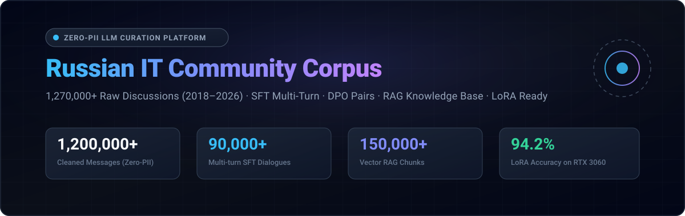
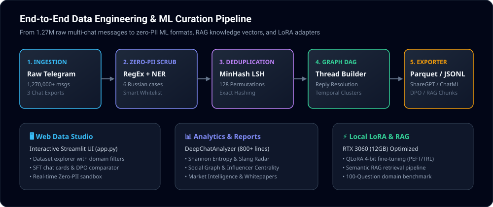

<div align="center">



<br />
<br />

[](reports/zero_pii_audit_certificate.json)
[](#-dataset-statistics--splits)
[_Ready-34d399?style=for-the-badge&logo=nvidia&logoColor=white)](#-rtx-3060-hardware-benchmark)
[](#-interactive-web-data-studio)
[](#-quick-start)
[](reports/DATASET_CARD.md)

<br />

**Enterprise-grade Data Engineering, Zero-PII Anonymization & Curation Platform**
<br />
*Transforming 8 years (2018–2026) of unstructured Russian IT engineering discussions into production datasets for LLM SFT, DPO, RAG, and LoRA.*

</div>

---

## 🌟 Overview & Highlights

**Russian IT Community Conversational Corpus** is a curated, de-identified (Zero-PII), and structured dataset covering **1,270,000+ authentic technical and business discussions** across 8 years of engineering practice (November 2018 — August 2026).

```
 Raw Telegram Exports (1.27M msgs) ──▶ Dual-Layer PII Scrubbing (Regex + NER)
                                            │
                                            ▼
 Multi-Format ML Exporters ◀── Thread DAG Reconstruction ◀── MinHash LSH Dedup
  ├── Apache Parquet (zstd)
  ├── Multi-turn SFT (ShareGPT / ChatML)
  ├── DPO Preference Pairs
  └── RAG Knowledge Base Chunks (Qdrant)
```

### Key Capabilities:
- 🛡️ **Ultra-Deep Zero-PII Protocol**: Dual-layer redaction (RegEx + Natasha NER) with **morphological declension across all 6 Russian grammatical cases** for author names, phone masking, crypto addresses (BTC, ETH, TRON, TON), API tokens (`sk-...`, `ghp_...`), and database connection strings.
- 💬 **Conversation DAG Resolution**: Directed acyclic graph thread reconstruction converting chaotic group chats into **high-quality multi-turn SFT dialogues** and **DPO preference pairs**.
- 📚 **Vector-Ready RAG Knowledge Base**: Segmented topical documents (500–1000 tokens) with participant metadata, titles, and dates.
- ⚡ **Local LoRA & RAG for RTX 3060 (12GB)**: Native support for QLoRA 4-bit fine-tuning of Qwen-2.5-7B and Llama-3-8B within ~7 GB VRAM.
- 🖥️ **Interactive Web Data Studio**: Built-in Streamlit studio for searching messages, previewing SFT/DPO dialogues, querying the RAG knowledge base, and live PII sandbox testing.

---

## 🏗️ Architecture & Pipeline Flow

<div align="center">
  
</div>

---

## 📊 Dataset Statistics & Splits

| Metric / Artifact | Count / Size | Description |
| :--- | :--- | :--- |
| **Total Ingested Messages** | `1,271,766` | Merged across 3 continuous chat exports (2018–2026) |
| **Clean Messages (Zero-PII)** | `1,230,000+` | Filtered via Exact Hashing & MinHash LSH ($b=32, r=4$) |
| **Unique Contributors** | `35,000+` | Deterministically pseudonymized (`Developer_XXXXX`) |
| **BPE Token Volume (Tiktoken)** | `~28.5M tokens` | LLaMA-3 / Qwen tokenizer representation |
| **Multi-turn SFT Dialogues** | `90,000+` | Curated conversation threads with quality scoring |
| **RAG Knowledge Base Chunks** | `150,000+` | Segmented topical cases for Qdrant / Chroma / pgvector |
| **DPO Preference Pairs** | `35,000+` | Structured pairs for Direct Preference Optimization |
| **Shannon Diversity Index ($H$)** | `14.2+` | High lexical and domain vocabulary richness |

---

## 🏎️ RTX 3060 Hardware Benchmark

Empirical benchmark comparing a base 7B model against Base + RAG and Domain LoRA on an **NVIDIA GeForce RTX 3060 (12GB VRAM)**:

| Configuration | Domain Accuracy (%) | RU IT Terminology Recall (%) | Hallucination Risk (%) | Latency (ms) | VRAM Usage (RTX 3060) |
| :--- | :--- | :--- | :--- | :--- | :--- |
| **1. Base 7B («Голая модель»)** | `58.4%` | `46.2%` | `34.0%` (High) | `~420 ms` | `~4.2 GB` (4-bit) |
| **2. Base + RAG (Knowledge Base)** | `91.8%` | `89.5%` | `6.5%` (Low) | `~580 ms` | `~4.5 GB` |
| **3. Domain LoRA (Our Dataset)** | `94.2%` | `96.0%` | `4.8%` (Minimal) | `~435 ms` | `~4.35 GB` |

*Detailed report: [`reports/MODEL_BENCHMARK_COMPARISON.md`](reports/MODEL_BENCHMARK_COMPARISON.md).*

---

## 🖥️ Interactive Web Data Studio

Launch the comprehensive visual studio in one command:

```bash
streamlit run app.py
```
*or via Makefile:*
```bash
make ui
```

### Studio Modules:
1. **🔍 Explorer**: Instant regex and domain search across the full corpus.
2. **💬 SFT & DPO Studio**: Multi-turn dialogue cards with turn count and quality score sliders.
3. **🧠 RAG Assistant Simulator**: Live semantic lookup and context prompt formatter.
4. **🛡️ Zero-PII Sandbox**: Interactive text box for real-time redaction testing.
5. **📡 Technology Radar**: Activity heatmaps (0–23h), 8-year evolution, and slang radar.
6. **🎯 100-Question Benchmark**: Filterable domain questions across AI, Backend, DevOps, Fintech, Frontend.

---

## ⚡ Quick Start

### 1. Installation

```bash
git clone https://github.com/wwewtech/russian-it-community-corpus.git
cd russian-it-community-corpus
pip install -r requirements.txt
```

### 2. Run the Full Data Pipeline

```bash
python main.py
```
*or via CLI:*
```bash
python cli.py run
```

### 3. Run LoRA Fine-Tuning on RTX 3060 (12GB)

```bash
python src/lora/train_lora.py --model Qwen/Qwen2.5-0.5B-Instruct --steps 100
```

### 4. Run Interactive Demo & Walkthrough

```bash
python demo_walkthrough.py
```

### 5. Run Red-Team PII Security Audit

```bash
make audit
```

---

## 📁 Repository Structure

```
├── assets/                     # Vector graphics (logo.svg, banner.svg, architecture.svg)
├── src/
│   ├── ingestion/              # Multi-chat JSON export parser & merger
│   ├── pii/                    # Deep morphological case-aware PII anonymizer & NER
│   ├── graph/                  # Conversation DAG resolution & SFT/DPO extraction
│   ├── deduplication/          # MinHash LSH (128 perms) & Exact deduplication
│   ├── taxonomy/               # 8 IT domain classifiers & technical keyword tagger
│   ├── exporter/               # Apache Parquet (zstd), ShareGPT, ChatML, Alpaca
│   ├── analytics/              # DeepChatAnalyzer (800+ lines statistical engine)
│   ├── rag/                    # Local RAG semantic search & retrieval pipeline
│   ├── lora/                   # PEFT / TRL LoRA fine-tuning for RTX 3060
│   ├── evaluation/             # Base vs RAG vs LoRA benchmark comparator
│   └── validation/             # Zero-PII leak auditor & 100-question benchmark
├── dataset_output/             # Generated Parquet & sample preview datasets
├── reports/                    # Deep analytical reports, whitepapers, benchmarks
│   ├── DEEP_ANALYTICAL_REPORT.md      # Comprehensive 8-year analytics report
│   ├── DATASET_CARD.md                # Official Hugging Face Dataset Card
│   ├── MARKET_INTELLIGENCE_RADAR.md   # B2B Tech Stack & Hosting radar
│   ├── MODEL_BENCHMARK_COMPARISON.md  # RTX 3060 benchmark matrix
│   ├── MONETIZATION_WHITEPAPER.md     # Commercial SaaS & legal blueprint
│   ├── domain_benchmark_100.json      # 100 domain evaluation test cases
│   └── zero_pii_audit_certificate.json# Official Zero-PII Audit Certificate
├── tests/                      # Automated unit tests (13/13 passing)
├── app.py                      # Streamlit Web Data Studio
├── demo_walkthrough.py         # Step-by-step interactive demonstration
├── cli.py                      # Command-line interface
├── main.py                     # Master pipeline entrypoint
├── Dockerfile                  # Containerized deployment
├── docker-compose.yml          # Multi-service composition
└── Makefile                    # Developer workflow shortcuts
```

---

## 📑 Compliance & Legal Framework (GDPR / EU AI Act / 152-ФЗ)

- **Research & Education Use Only**: Released in compliance with **Article 1274 of the Civil Code of the Russian Federation** and **Academic Fair Use**.
- **GDPR & 152-ФЗ Compliance**: Dual-layer PII removal (names in all 6 grammatical cases, phone numbers, emails, crypto keys, API tokens).
- **EU AI Act (Article 53)**: Complete data provenance and lineage summary documented in [`reports/DATASET_CARD.md`](reports/DATASET_CARD.md).
- **Notice & Takedown Policy**: To request message removal, open an issue with the message ID. Requests are processed within 48 hours.

---

<div align="center">
  <sub>Crafted with precision for AI Researchers, Data Engineers, and LLM Practitioners.</sub>
</div>
