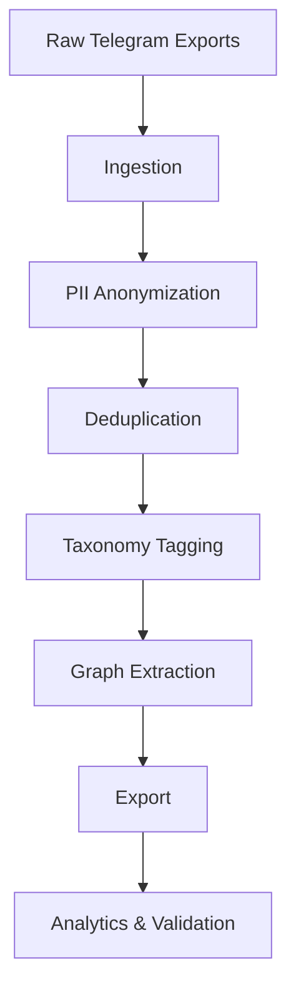

# Architecture Overview

RICC follows a **7-stage pipeline architecture** with clear separation of concerns, typed interfaces, and observability built-in.

## Pipeline Stages



| Stage | Module | Input | Output |
|-------|--------|-------|--------|
| 1. Ingestion | `src.ingestion.loader` | JSON exports | `NormalizedMessage[]` |
| 2. PII Anonymization | `src.pii.deep_anonymizer` | `NormalizedMessage[]` | `CleanedMessage[]` |
| 3. Deduplication | `src.deduplication.*` | `CleanedMessage[]` | `CleanedMessage[]` (deduped) |
| 4. Taxonomy Tagging | `src.taxonomy.tagger` | `CleanedMessage[]` | `CleanedMessage[]` (tagged) |
| 5. Graph Extraction | `src.graph.*` | `CleanedMessage[]` | `SFTDialogue[]`, `RAGChunk[]`, `DPOPair[]` |
| 6. Export | `src.exporter.*` | Datasets | Parquet + JSONL |
| 7. Analytics/Validation | `src.analytics.*`, `src.validation.*` | Artifacts | Reports + SLO verdict |

## Key Design Principles

### 1. Type Safety
- All data models use **Pydantic v2** (`src/ingestion/schema.py`)
- `mypy --strict` on 31+ modules
- `Result[T, E]` for functional error handling

### 2. Single Source of Truth
- Configuration: `src/settings.py` (`pydantic-settings`)
- Pipeline params: `params.yaml` (DVC)
- No hardcoded values in business logic

### 3. Observability First
- Structured logging via `structlog` (JSON)
- Prometheus metrics on every stage
- SLO gate with SHIP/HOLD verdicts

### 4. Graceful Degradation
- Prefect orchestration optional (`try/except ImportError`)
- DVC optional (filesystem fallback)
- GPU training optional (CPU fallback)

### 5. Security by Default
- Zero-PII design (fail-closed)
- Read-only Docker containers
- No secrets in code (`.env.example` template)
- Artifact integrity via SHA256 manifests

## Data Flow

```
Telegram JSON
     │
     ▼
NormalizedMessage (raw)
     │
     ▼
PII Scrubbing (Regex + NER)
     │
     ▼
CleanedMessage (anonymized)
     │
     ▼
Exact Deduplication (SHA256)
     │
     ▼
MinHash LSH (Jaccard ≥ 0.80)
     │
     ▼
CleanedMessage (deduplicated)
     │
     ▼
Domain Classification (9 domains)
     │
     ▼
Keyword Tagging (Aho-Corasick)
     │
     ▼
CleanedMessage (tagged)
     │
     ▼
Thread DAG (reply-time heuristic)
     │
     ▼
SFTDialogue / RAGChunk / DPOPair
     │
     ▼
Parquet + JSONL (ShareGPT/Alpaca/ChatML)
     │
     ▼
Analytics + Validation + PII Audit
     │
     ▼
SLO Gate → SHIP / HOLD
```

## Module Structure

```
src/
├── bootstrap.py          # Runtime env setup (UTF-8, HF, tokenizers)
├── config.py             # Legacy config (deprecated, use settings.py)
├── settings.py           # Unified pydantic-settings config
├── errors.py             # Typed exception hierarchy
├── observability/        # Logging + metrics
├── pipeline.py           # MasterDataPipeline orchestrator
├── ingestion/            # Load & normalize Telegram exports
├── pii/                  # PII scrubbing + anonymization
├── deduplication/        # Exact + MinHash LSH
├── taxonomy/             # Domain classification + tagging
├── graph/                # Thread DAG + conversation extraction
├── exporter/             # Parquet + JSONL exporters
├── analytics/            # Deep statistical/semantic analysis
├── validation/           # Schema + PII audit + artifact integrity
├── monitoring/           # Drift + SFT quality + SLO gate
├── lora/                 # LoRA training + model registry
├── rag/                  # Hybrid RAG pipeline
├── evaluation/           # Benchmark comparators
├── orchestration/        # Prefect flow (optional)
└── ricc/                 # Public API package
```

## Extensibility Points

- **Custom PII detectors** — Extend `RegexScrubber` or `NERScrubber`
- **New domains** — Add to `DOMAIN_TAXONOMY` in settings or `params.yaml`
- **Export formats** — Implement `Exporter` protocol
- **Validation checks** — Add to `DatasetValidator`
- **Drift metrics** — Extend `DatasetDriftMonitor`