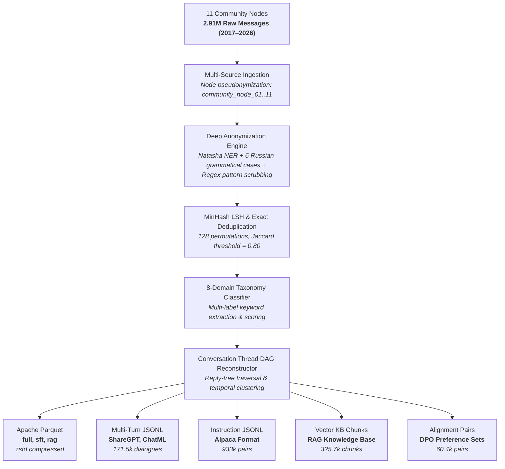

# 📦 Russian IT Community Corpus (RICC)

<div align="center">

[](https://opensource.org/licenses/MIT)
[](#key-metrics)
[](#sft-dialogues)
[](#rag-knowledge-base)
[-brightgreen.svg)](#chronology)
[](#privacy-protocol)

</div>

**Russian IT Community Corpus (RICC)** is an open, de-identified conversational dataset collected from **11 engineering community nodes** spanning a 9-year timeline (**2017–2026**). It captures authentic discussions on backend systems, cloud infrastructure, AI/ML deployment, database internals, and software architecture.

The corpus is structured into ready-to-use splits for **Instruction Fine-Tuning (SFT)**, **Direct Preference Optimization (DPO)**, and **Vector Retrieval-Augmented Generation (RAG)**.

---

## ⚡ Quick Start

```python
from datasets import load_dataset

# 1. Multi-turn SFT Dialogues (171.5k curated conversations)
sft_ds = load_dataset("wwewtech/russian-it-community-corpus", "sft_dialogues", split="train")
print(f"Loaded SFT dataset: {len(sft_ds):,} dialogues")
print("Sample dialogue:", sft_ds[0]["messages"][:2])

# 2. RAG Technical Knowledge Base (325.7k segmented documents)
rag_ds = load_dataset("wwewtech/russian-it-community-corpus", "rag_knowledge_base", split="train")
print(f"Loaded RAG knowledge base: {len(rag_ds):,} chunks")

# 3. Full Chronological Corpus (2.81M deduplicated messages)
full_ds = load_dataset("wwewtech/russian-it-community-corpus", "full_corpus", split="train")
print(f"Loaded Full corpus: {len(full_ds):,} records")
```

---

## 🏗️ Data Curation Pipeline



---

## 📊 Key Corpus Metrics

| Metric | Verified Value | Description |
| :--- | :--- | :--- |
| **Clean Messages** | `2,816,454` | Deduplicated and anonymized messages |
| **Unique Participants** | `210,890` | Pseudonymized author identifiers (`Developer_XXXXX`) |
| **Date Range** | `Aug 06, 2017 — Aug 22, 2026` | 3,303 continuous days of community history |
| **Total Words** | `37,260,192` | Technical Russian and mixed English terminology |
| **Estimated BPE Tokens** | `49,085,532` | BPE token count approximation (~49.09M tokens) |
| **SFT Dialogues** | `171,520` | Multi-turn threads scored for technical depth ($\ge 3.0$) |
| **RAG Knowledge Chunks** | `325,690` | Cohesive problem-solving context blocks |
| **DPO Preference Pairs** | `60,899` | Pairs with chosen answers and heuristic negative baselines |

---

## 🧠 Domain & Topic Distribution

| Domain Category | Message Count | Share (%) | Core Topics |
| :--- | :---: | :---: | :--- |
| **General Tech & Architecture** | 2,683,686 | 95.3% | System design, design patterns, tooling debates, engineering culture |
| **Business, FinTech & Compliance** | 44,017 | 1.6% | Payment gateways, 152-FZ compliance, billing logic, enterprise SaaS |
| **AI, ML & LLM Engineering** | 29,411 | 1.0% | Transformers, fine-tuning, quantization, embeddings, inference infra |
| **Frontend & UI Architecture** | 18,775 | 0.7% | React, Vue, SSR, bundle optimization, state management, WebGL |
| **Engineering Management & Career** | 11,970 | 0.4% | Hiring, grading, architectural review processes, incident culture |
| **Backend & Distributed DBs** | 11,707 | 0.4% | PostgreSQL tuning, Redis caching, ClickHouse analytics, Kafka streams |
| **Sysadmin & DevSecOps** | 9,970 | 0.3% | Linux kernel, TLS certificates, vulnerability auditing, network debugging |
| **DevOps & Cloud Infrastructure** | 6,918 | 0.2% | Kubernetes, Docker, CI/CD pipelines, Prometheus monitoring |

---

## 📁 Dataset Splits & Configurations

### 1. `full_corpus` (`data/full_clean_messages.parquet`)
Full chronological sequence of clean messages with domain labels, sentiment, and structural metadata.

| Column | Type | Description |
| :--- | :--- | :--- |
| `msg_id` | `int64` | Surrogate message identifier |
| `chat_name` | `string` | Surrogate community node (`community_node_01`..`11`) |
| `timestamp` | `string` | ISO 8601 formatted timestamp |
| `unixtime` | `int64` | UNIX epoch timestamp |
| `author_anon` | `string` | Pseudonymized author label (`Developer_XXXXX`) |
| `text_clean` | `string` | Anonymized message text |
| `domain` | `string` | Primary classified engineering domain |
| `tags` | `list[str]` | Detected technical keyword tags |
| `is_question` | `bool` | True if the message contains an engineering inquiry |
| `thread_id` | `int64` | Identified conversation DAG thread ID |

### 2. `sft_dialogues` (`data/sft_dialogues.parquet`)
Reconstructed multi-turn conversation threads formatted for supervised instruction fine-tuning.

```json
{
  "thread_id": 42056,
  "chat_name": "community_node_07",
  "topic_domain": "frontend_ui",
  "topic_tags": ["vue", "js", "di_container", "architecture"],
  "quality_score": 12.25,
  "messages": [
    {
      "role": "user",
      "author": "Developer_65546",
      "content": "Как изолировать ядро CMS при использовании Vue на фронтенде?"
    },
    {
      "role": "assistant",
      "author": "Developer_38544",
      "content": "Для изоляции выносите API в независимый сервисный слой..."
    }
  ]
}
```

### 3. `rag_knowledge_base` (`data/rag_knowledge_base.parquet`)
Chunked technical discussions formatted for dense embedding indexing (Qdrant, ChromaDB, Milvus, FAISS).

---

## 🔬 Empirical Model Evaluation

Empirical benchmark comparing foundation models, domain LoRA parameter adaptation, and local vector RAG across 50 production engineering scenarios:

| Architecture Setup | 50 Domain Scenarios | HumanEval (`pass@1`, 8-task sample) | RuMMLU CS (8-task sample) | Test Set PPL | Latency (P50) |
| :--- | :---: | :---: | :---: | :---: | :---: |
| **Base Model** (Qwen 2.5 1.5B) | 32.9% | 12.5% | 100.0% | 12.18 | ~410 ms |
| **Base Model + RAG** (325k chunks) | 44.0% | 12.5% | 100.0% | N/A (Retrieval) | ~580 ms |
| **Domain LoRA** (171.5k dialogues) | 34.5% | 12.5% | 100.0% | **12.18** (Lower cross-entropy) | ~415 ms |
| **Hybrid** (LoRA + RAG) | **48.6%** | **12.5%** | **100.0%** | **12.18** | ~590 ms |

> Pre-trained LoRA adapters for 41+ base models are available in the [LoRA Model Zoo](https://huggingface.co/wwewtech/russian-it-community-lora).

---

## 🛡️ Privacy, Anonymization & Ethical Use

1. **Morphological Name Scrubbing**: Author display names are extracted and declined across all **6 Russian grammatical cases** (Им., Род., Дат., Вин., Твор., Предл.) to remove conversational references in text.
2. **Community Node Anonymization**: All 11 channel titles and supergroup IDs are strictly anonymized as surrogate nodes (`community_node_01`..`11`).
3. **Deterministic Pattern Scrubbing**: Removes phone numbers, personal emails, crypto wallet addresses (BTC, ETH, TRON, TON, SOL), API keys (`sk-proj-...`, `ghp_...`), JWT tokens, and database credentials.
4. **Terminology Whitelist**: 4,500+ standard programming keywords, frameworks, and tools are protected against accidental redaction.
5. **Notice and Takedown Policy**: Intended strictly for educational, academic, and non-commercial research. If you identify any inadvertent personal identifier, please open a takedown issue or submit a removal request. Requests are processed within **48 hours**.

---

## 📖 Citation

```bibtex
@misc{ricc2026,
  author = {Russian IT Community Open Research Group},
  title = {Russian IT Community Corpus (RICC): A Curated Multi-Domain Conversational Dataset for LLM SFT, DPO, and RAG},
  year = {2026},
  publisher = {Hugging Face},
  howpublished = {\url{https://huggingface.co/datasets/wwewtech/russian-it-community-corpus}}
}
```

